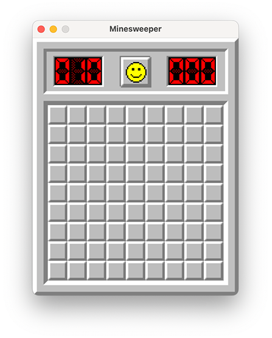

# Classic Minesweeper in Pygame

Recreation of the classic Minesweeper game with modern Pygame visuals and mechanics.  
Game built using [Pygame](https://www.pygame.org/news) in Python.



---

## Requirements


Make sure you have Python 3 installed, then install the required dependencies from `requirements.txt`. For example:

```bash
pip install -r requirements.txt
```

---

## TODO

- [ ] Implement proper face and tile animation when hovered over and when the mouse button is pressed
- [ ] Implement an options menu with multiple difficulty levels (Beginner, Intermediate, Expert)
- [ ] Implement a pop-up window for "Failed" and "Solved" messages
- [ ] Add a high-score or best-time record system
- [ ] Add docstrings to all functions
- [ ] Implement a board solver to ensure the generated board is solvable without guessing
- [ ] Consider adding different classes or states to manage various game phases (e.g., "Running", "Paused", "GameOver")
- [ ] Offer different Minesweeper visuals and sounds for each Minesweeper version (Windows 3.1, XP, 7)