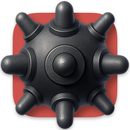

# Classic Minesweeper in Pygame

<table>
  <tr>
    <td>
      
    </td>
    <td>
      Python implementation of the classic Minesweeper game with modern visuals and mechanics.<br>
      Game built using <a href="https://www.pygame.org/news">Pygame</a>.
    </td>
  </tr>
</table>

<picture>
  <source media="(prefers-color-scheme: dark)" srcset="screenshots/theme_swap_beginner_dark.gif">
  
</picture>
---

## Requirements


Make sure you have Python 3 installed, then install the required dependencies from `requirements.txt`. For example:

```bash
pip install -r requirements.txt
```

---

## TODO

- [ ] Implement proper face and tile animation when hovered over and when the mouse button is pressed
- [x] Implement an options menu with multiple difficulty levels (Beginner, Intermediate, Expert)
- [ ] Implement proper menu bar
- [ ] Implement a pop-up window for "Failed" and "Solved" messages
- [ ] Add a high-score or best-time record system
- [ ] Add docstrings to all functions
- [ ] Implement a board solver to ensure the generated board is solvable without guessing
- [ ] Consider adding different classes or states to manage various game phases (e.g., "Running", "Paused", "GameOver")
- [x] Offer different Minesweeper visuals and sounds for classic Minesweeper versions (Windows 3.1, XP)
- [ ] Create theme for Aero Minesweeper (Windows Vista)
- [ ] Implement animations for tile generation, bomb detonation, and more